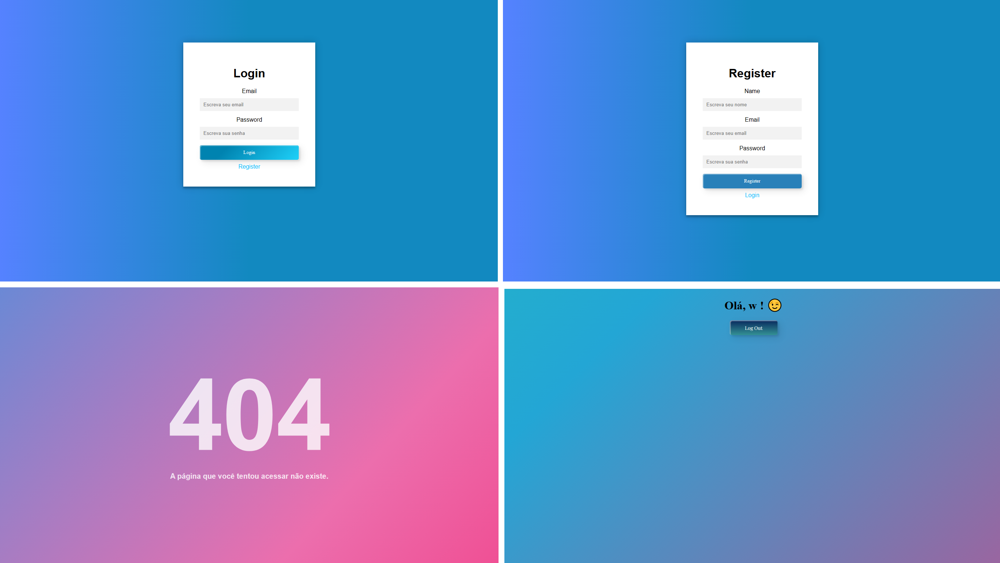

<h1 align="center"> 
    Meme-Generator
</h1>

  <a href="#-About">About</a>&nbsp;&nbsp;&nbsp;|&nbsp;&nbsp;&nbsp;
  <a href="#-Project">Project</a>&nbsp;&nbsp;&nbsp;|&nbsp;&nbsp;&nbsp;
  <a href="#-Technology">Technology</a>

    

<h5 style="text-align: center"> Thank you for see !</h5>

## 📚 Sobre

Olá! Nesse projeto estarei demonstrando algumas funcionalidades do **Node.js**, por meio de código, estarei apresentando como framework **_Express.js_** nos ajuda na construções de servidores web, além do Express.js usamos o **_npm_** para instalar ferramentas que nos ajudaram na **_criação das páginas em si_** e nos beneficiou na **_autenticações de usuário_**. Mecionando ainda páginas foi adicionado **_redirect 404_** em casos da página/rota não existir, adotamos o pacote **_passport_** para gerenciamento de estado do login do usuário, foi aplicado a **_criptografia e hash_**, restringimos o acesso às rotas apenas a usuários logados e por fim usamos o **_flash_** para exibição de mensagens.

Para ter acesso a conteúdo similares, acesse [WebDevSimplified](https://www.youtube.com/@WebDevSimplified)

## 🚀 Technology

O projeto foi desenvolvido a partir das tecnologias:

- *HTML5*
- *CSS*
- *NODE.JS*

## 📚 About

Hello! In this project I will be demonstrating some functionalities of **Node.js**, through code, I will be presenting how framework **_Express.js_** helps us in the construction of web servers, in addition to Express.js we use **_npm_** to install tools that helped us in the **_creation of the pages themselves_** and benefited us in **_user authentication_**. Also mentioning pages, **_redirect 404_** was added in cases where the page/route does not exist, we adopted the **_passport_** package for managing the user's login state, it was applied to **_cryptography and hash_**, we restricted access to routes to logged-in users only and finally we used **_flash_** to display messages.

*To access similar content, go to [Web Dev Simplified]((https://www.youtube.com/@WebDevSimplified))*

## 🚀 Technologies Used:

*The project was developed based on technologies:*

- *HTML5*
- *CSS*
- *NODE.JS*

--------------

Developed by :atom_symbol: [**Arthur Silva**]([arthursj (ArthurSilva) (github.com)](https://github.com/arthursj))